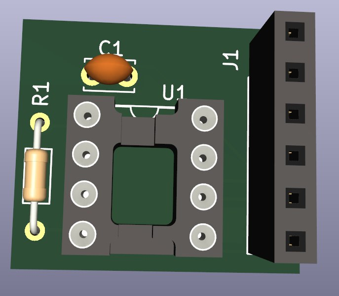
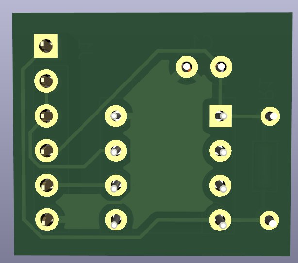
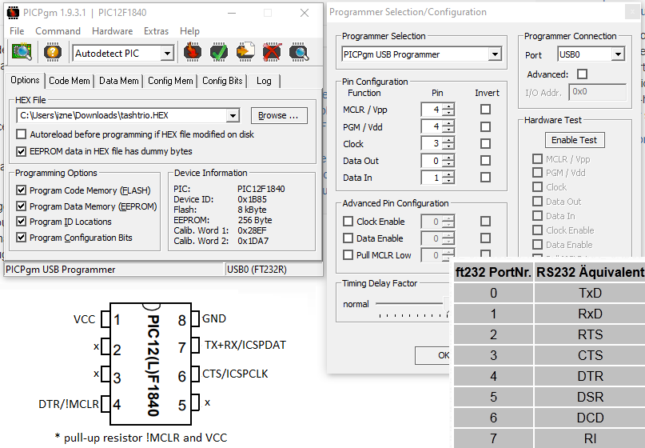

# PIC12 Low-voltage programmer board for FT23 adapters
A minimalistic PIC12 low-voltage programmer (ICSP LVP) breakout board for FTDI FT232R adapters

# Purpose
Using an FTDI adapter, one can program a PIC12-series microcontroller using the ICSP LVP method.

# LVP Limitations
Note that ...

# General
The board can be used generally for ICSP LVP programming but a socket is mounted that suits a demonstrator case with PIC12F1840. Using another socket, socket adapter or simply jumper wires would make it possible for a variety of other PIC microcontrollers, that support LVP.

# Board renders

# PICPgm on Windows

# fpicprog on Linux

